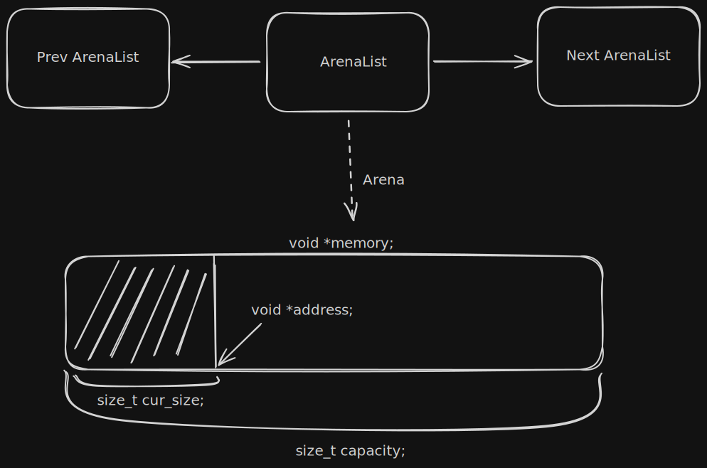
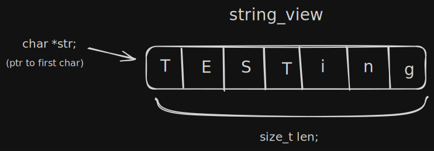
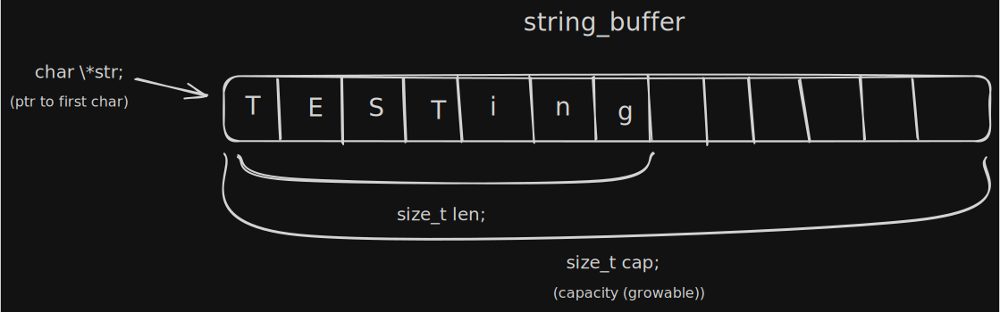

## Lib3man

Lib3man is a small C library I'm building for learning purposes and to use in my other C projects.

### It has:

- #### `Arena Allocator` :
  
- #### `Length-based string (string view)` :
  
- #### `Dynamically allocated strings (string buffer)` :
  
- #### `Matrix (Math Matrix)`
- #### `Utilities (os based pseudo-random)`

### Project Structure

```text
.
├── includes
│   └── lib3man.h   # Unified header file
├── lib
│   ├── lib3man.a   # Static library (Mingw (windows), gcc, clang)
│   └── lib3man.lib # Static library (msvc)
│
├── main.c          # Testing the library
│
└── src
    ├── arena.c     # Memory Arenas and Arena-list
    ├── matrix.c    # String view, String buffer
    ├── string.c    # Matrix
    └── utility.c   # OS based pseudo-random

```

### Goals

- Explore low-level C design, memory management, math etc...
- Build a personal "Standard Library" for my other projects.
- Having fun while also understanding complex concepts.
